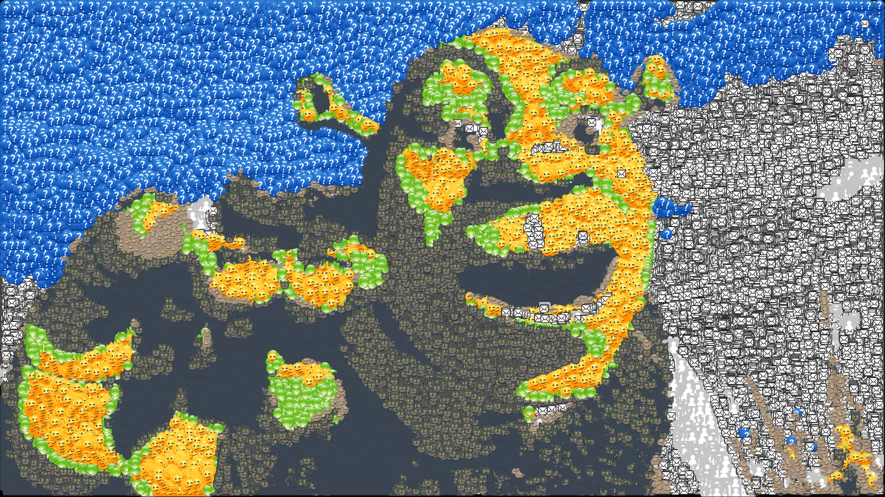

# Image Reconstructor

This program turns an ordinary image and one or multiple stencils into an image created solely with those stencils.

## Usage example

The project includes a sample image and some sample stencils, in the `stencils` folder.


If everything is configured correctly, you should see the following image:



## Installation

Any OS I guess:

Install [Julia](https://julialang.org/)

In order to use multithreading (HIGHLY recommended), set the environment variable:
```sh
set JULIA_NUM_THREADS=x
```
Where x is the amount of threads that you can use. For most computers it's double the amount of cores. So a 4 core processor can use 8 threads.


Launch the script from the command line.
```sh
julia CLI.jl -i shrek.jpg -s stencils -r result.png --iterations 10000
```
* `-i` is for the image location (png, jpg, jpeg, and gif file formats accepted)
* `-s` is for the stencils folder location
* `-r` is for the result image location (_optional, defaults to `result.png`_)
* `--iterations` if the amount of extra stencils to try and place after the initial fill
* `--improve` can be also added if you want to improve the resulting image without starting from scratch.

Or use:
```sh
julia StaticInterface.jl
```
Where you need to edit the file to present all folders and options.

## Contributing

There's a lot of work that can be put into this program, I will list some stuff that would be great if implemented.
Any other stuff is also cool.

* GUI
* ~~CLI~~
* Support for stencils of differing sizes
* Speed up are always great
* Better video support
* Live preview?

## Release History
* 0.1.1 "Fixed the breaking" Edition
  * It now doesn't use a module (Julia did not make this less painful)
* 0.1.0 "Might have broken everything for the sake of speed" Edition
  * Optimized everything for speed
  * It now uses a module (Julia pls make this less painful)
* 0.0.2 "Works on other machines" Edition
  * Actual project environment thanks to Vexatos
  * Automatic adjustment of max threads thanks to zachmatson
  * Opacity is now scaled instead of binary
* 0.0.1 "Works on my machine" Edition
  * Initial shitty script

## Contributors

Simon381#9384 - u\JanDoedelGaming

Don't hesitate to contact me or make an issue for any issues with the code.
